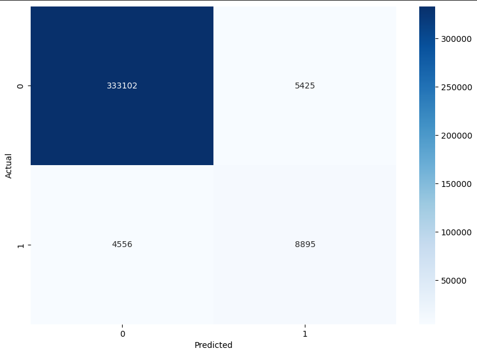
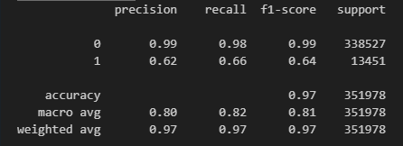
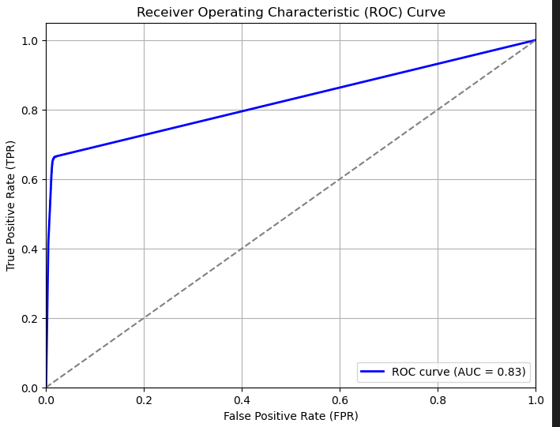
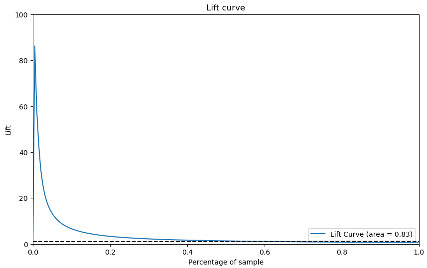

# Objective of the Returns Management Project 

-  Give business insights to the client regarding the returned products situation  
-  Create a model to predict the returns based on provided data.

# Installation
To install the 8_Returns_management script , follow these steps:

    - Clone the repository to your local machine using the command :
        git clone https://github.com/slvg01/8_Returns_management.git
    
    - get into the project folder:
        cd 8_Returns_management
    
    - Ensure that you have the required dependencies installed by executing:
        pip install -r requirements.txt
    

# How to use
   
- The prediction model (XGBoost) was trained on the data after preprocessing. Its running script is main.py. It allows for launching a prediction interface on your local machine through FastAPI. To access that interface:
        - In your terminal, run main:app --reload
        - Click on the documentation button.

- Note that the initial dataset is not available in the repo by default. Please contact me if you have any questions about it.

- Moreover, you will find some interesting additional files in this repo:
        - A PDF presentation of the main output of this study as well as the main model features.
        - An EDA notebook that supports the above main outputs.
        - The preprocessing notebook.
        - The model artifact is in the model folder.

# Main Conclusions 

- Even with limited data and understanding of the data, it appears that returns can be optimized by managing better the outliers on many of the features. There are indeed specific, 
     - price bands, 
     - products, 
     - brands, 
     - clients, 
     - and shops 
     
that are **TRIGGERING RETURNS FAR ABOVE AVERAGE AND UP TO 100%**
     Deeper analysis may be conducted to come up with a relevant strategy regarding those.

- We tested 3 machine learning models and 2 neural networks. 
     - XGBoost was the best performer on F1 criteria (which appeared initially to be the best initial performance monitoring parameter). 
     - Note that the dataset is extremely unbalanced towards the class 0 as return rate is below 4%. Rebalancing was necessary for the modeling.

- The prediction model at the moment is reaching a 64% on F1, 83% on ROC, and an aggressive lift curve. Before going further on the modeling, it is necessary to:
    - Get input from the client regarding what is the most critical in their eyes to optimize: Precision or Sensitivity (recall).
    - Get a better understanding of the data logging flow to determine what to do with the massive amount of duplicates.

    
     
  

     
  

